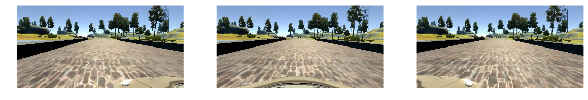
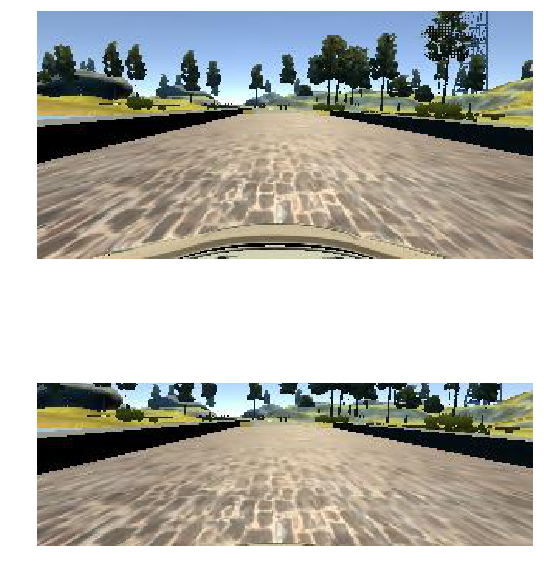
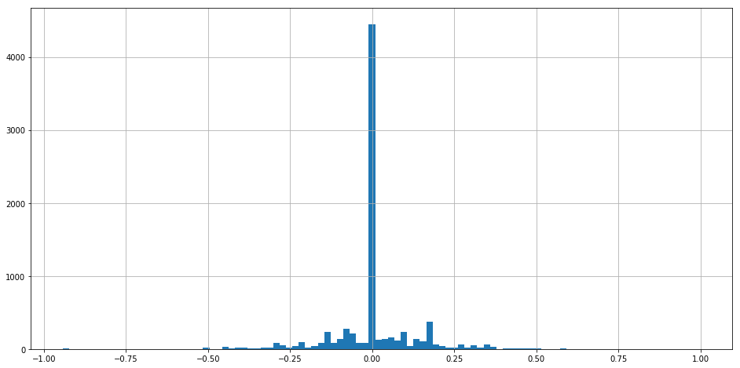
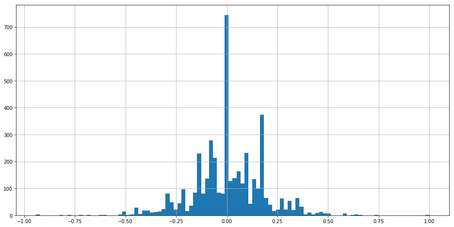

# Project 3 - CarND-Behavioral-Cloning

In this project, a video game-like car simulator is provided. Which records images from 3 front cameras(left, center and right) and the steering angles simultaneously. So assuming we manually drive it for a while, the recorded data can be used to train a DNN model that can simulate human's behavior.

## Dataset

Initially I wanted to generate my own dataset. However my 2014 MBP seems can't play the simulator smoothly so the car constantly drive outward the roads even with human driver(in this case, me!). Many classmates suggested that the course provided data is enough to train a working model so I decided to stick on using that.

There are 8036 items in the driving_log.csv. It has 7 columns.
 1. Center image filename (String)
 2. Left image filename (String)
 3. Right image filename (String)
 4. Steering (Float)
 5. Throttle (Float, not used in my model)
 6. Brake (Float, not used in my model)
 7. Speed (Float, not used in my model)

**Sample images**


I only used the images and the steering. The throttle, brake and speed were dropped.

## CNN Model

I am using the same model described in the NV's paper.

| Layer (type)                    | Output Shape         | Param #    |
|---------------------------------|----------------------|------------|
| lambda_1 (Lambda)               | (None, 66, 200, 3)   | 0          |
| convolution2d_1 (Convolution2D) | (None, 31, 98, 24)   | 1824       |
| convolution2d_2 (Convolution2D) | (None, 14, 47, 36)   | 21636      |
| convolution2d_3 (Convolution2D) | (None, 5, 22, 48)    | 43248      |
| convolution2d_4 (Convolution2D) | (None, 3, 20, 64)    | 27712      |
| convolution2d_5 (Convolution2D) | (None, 1, 18, 64)    | 36928      |
| flatten_1 (Flatten)             | (None, 1152)         | 0          |
| dropout_1 (Dropout)             | (None, 1152)         | 0          |
| dense_1 (Dense)                 | (None, 100)          | 115300     |
| dropout_2 (Dropout)             | (None, 100)          | 0          |
| dense_2 (Dense)                 | (None, 50)           | 5050       |
| dense_3 (Dense)                 | (None, 10)           | 510        |
| dense_4 (Dense)                 | (None, 1)            | 11         |
|                                 | Total params         | 252,219    |

It's worthy to mentioned that I didn't use any pooling here as NV paper mentioned used stride = 2 in the first 3 CNN layers. It inherently reduced the output size already.

```
model.add(Convolution2D(24, 5, 5, border_mode='valid', activation='relu', subsample=(2, 2)))
```


## Preprocess the data

The input image dimension is 160x320 while NV paper's input is 66x200. I cropped the top 40 lines to remove the sky and removed bottom 180 lines to remove the hood. And also remove 10 pixels from each side. I got an 99x300 image. Then I resize it to 66x200. The reason I cropped the image to 99x300 first is it's exactly 3/2 of 66x200 in terms of the edge lengths. I think it might reduced the distortion when doing resize.

160x320x3 ==> 99x300x3 ==> 66x200x3



There are 4361 images with steering 0.0. It's too many then other steerings and might introduce bias. So I dropped 85% of it randomly. Then I split it to training set(80%) and validation set(20%). I only use center images for validation while using left/right images with compensate steerings for training.

**The steering distribution before dropping 0.0 samples**


**The steering distribution after dropping 85% of 0.0 samples**


### Colorspace

I was suffered that my model worked funny in the beginning. After I saved the images from drive.py then I understood the colorspace was RGB. CV2 library will use BGR while the simulator returns RGB array. After several experiments with RGB, GRAY, YUV and HSV. I choose to use HSV in the end.

### Normalization

The data type of the image array is UINT8 which ranges from 0 to 255. I normalized it to -1.0~1.0. Initially I used a python function to do the normalization.

```
img = img / 127.5 - 1.0
```

It actually works. But in Slack some classmates suggested to use Keras Lambda to do the same thing. I also experimented it.

```
model.add(Lambda(lambda x: x/127.5-1.0, input_shape=(66, 200, 3)))
```

Then I found it can save me 4 seconds in each epoch. I guess Tensorflow also delegate this task to GPU so it's more efficient.

### Augmentation

Apparently the provided sample data is not enough and imbalanced. So I need to do something to generate more legit data from it.

 1. Mirror all of them (flip Horizontally)
 2. Using left and right camera image w/ compensated steering value
 3. Randomly shift the images horizontally w/ minor compensated steering value

It introduced two parameters(cg.offset and cg.alpha in the code) needed to be decided.

## Training

I just used the Adam optimizer to avoid deciding learning rate and used mse(Mean Square Error) as loss function.

I ran 8 epochs every time, batch_size is 32.

## Validation

Only the center image in the validation set were used for validation. And it doesn't have any augmentation either. The validation error is about 0.011x. I didn't find it's meaningful in this case. The lower validation error doesn't mean the result in simulator would be better.

## Test on the simulator

I found the simulator is very sensitive to the PC loading. It behaves differently when I doing something else at the same time. The model works better when I ran it alone than the recorded one. It seems the quicktime desktop recorder also used a lot of CPU time and it made the drive.py can't response in time.

The trained model can successfully drive along the track 1. Surprisings that it ran zig-zag in the track 1 but it ran smoothly in the unseen track 2.

### Track 1

[](https://www.youtube.com/watch?v=USQEW1GypHI)

### Track 2

[](https://www.youtube.com/watch?v=lSMnE0966Qs)

## Conclusion

This is a very interesting project and it spent a lot of time to tune the parameters. Deep learning is dark art to me. It seems there is no silver bullet and always need a lot of trial and error. In this case, as the images from simulator is fair simple so some classmates use a very simple model can achieve good result. Based on my experiments then key is to provide enough data for each steering value. The result will be okay.

## References

 * Mengxi Wu's post: [Self-driving car in a simulator with a tiny neural network](https://medium.com/@xslittlegrass/self-driving-car-in-a-simulator-with-a-tiny-neural-network-13d33b871234#.d4x9utuie)
 * Vivek Yadav's post: [An augmentation based deep neural network approach to learn human driving behavior](https://chatbotslife.com/using-augmentation-to-mimic-human-driving-496b569760a9#.fqa6wv7we)
 * NVidia's paper: [End to End Learning for Self-Driving Cars - Nvidia](https://www.google.com.tw/url?sa=t&rct=j&q=&esrc=s&source=web&cd=2&cad=rja&uact=8&ved=0ahUKEwjp5KC01o_SAhXHVZQKHTPtCMcQFggpMAE&url=https%3A%2F%2Fimages.nvidia.com%2Fcontent%2Ftegra%2Fautomotive%2Fimages%2F2016%2Fsolutions%2Fpdf%2Fend-to-end-dl-using-px.pdf&usg=AFQjCNGgCrFq0dg2NHSt-N0gi9ult70wig&sig2=VgyvUTDg2KCUwYB9GGceXw)
